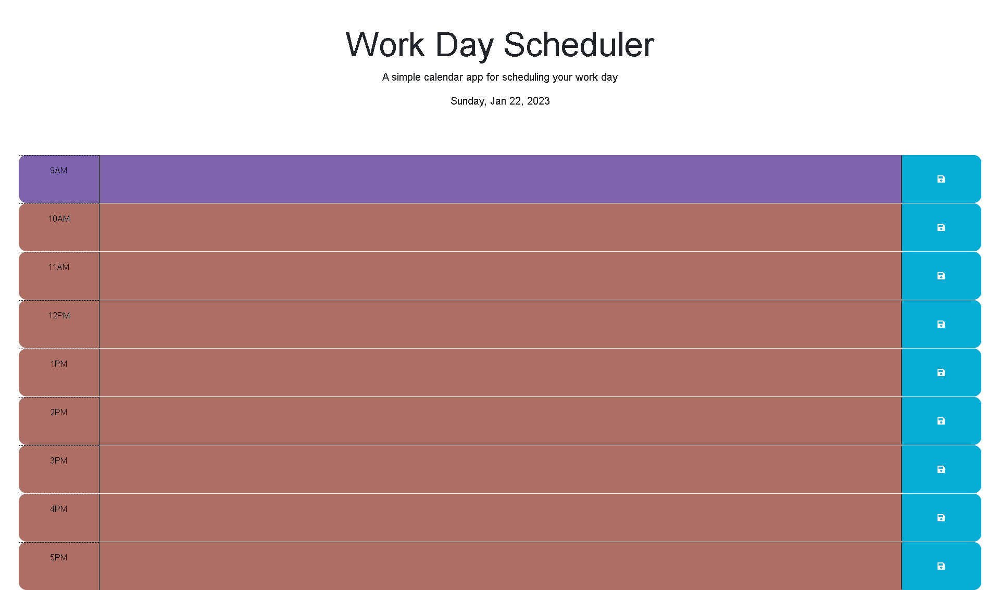

# Work Scheduler

## Description

This project was designed to explore and practice my JSON and Javascript skills. The purpose was to apply the time full days schedule, broken up by hour, so that a specific hour-block would let you know whether it occured in the past, present, or future, depending on the current time.

## Installation

N/A

## Usage

The is a web application that allows a user to store to-do items in a daily calendar format.

Below is a link to the deployed application as well as a screen grab of the app.

[Workday Scheduler](https://hermanea.github.io/work-scheduler-challenge05/)

## Credits

N/A

## License

Please refer to Github for licensing information.
git